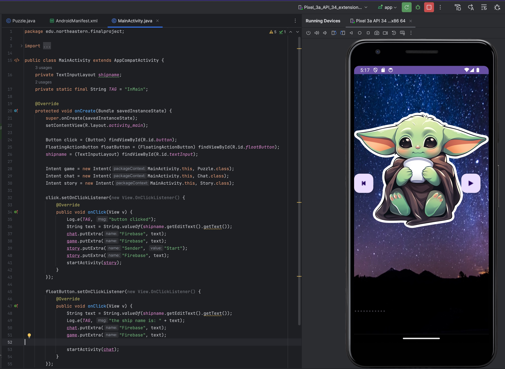
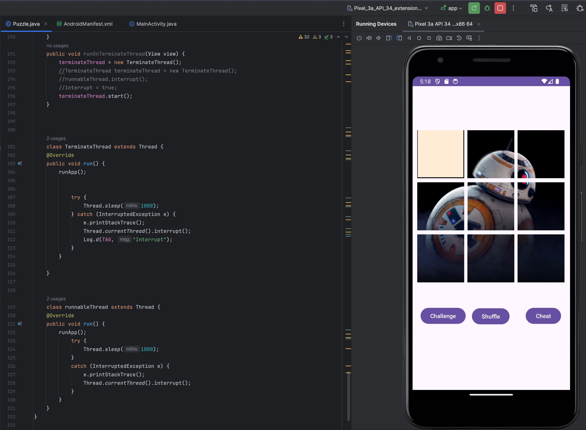

# Star puzzle Project
---
## Programming language
`andorid app using Java`   

---
## Description
This is a project embedded a `Java` program `puzzle game` into a android application. 
The core technique is to create a 2D ArrayList and a HashMap represent a n * n grid puzzle.   
User is responsible for moving the grid, when the grids trigger the pattern, program stop and the user is the winner

---
## Technique
* ArrayList
* Hashmap
* multiple threading
* Android onCreate()
* Android Manifest.xml
* orientation | screenSize

---
## Processing 

---
## Conclusion/ Downloadable
[Android_executable_file](./Resources/star-puzzle.apk)

